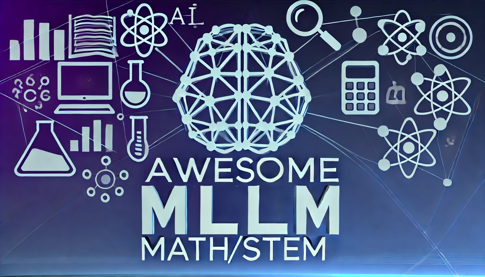

# Awesome-Multimodal-LLM-for-Math/STEM 

🔥 Collections of multi-modal LLM for Math/STEM/Code.

## Table of Content

- [Awesome-Multimodal-LLM-for-Math/STEM ](#awesome-multimodal-llm-for-mathstem-)
  - [Table of Content](#table-of-content)
  - [Awesome Papers](#awesome-papers)
  - [MLLM Math/STEM Dataset](#mllm-mathstem-dataset)
  - [MLLM Math/STEM Benchmark](#mllm-mathstem-benchmark)
  - [Contributors](#contributors)

## Awesome Papers

1. **MAVIS: Mathematical Visual Instruction Tuning** `Preprint`

   _Renrui Zhang, Xinyu Wei, Dongzhi Jiang, Yichi Zhang, Ziyu Guo,Chengzhuo Tong, Jiaming Liu, Aojun Zhou, Bin Wei, Shanghang Zhang, Peng Gao, Hongsheng Li._[[Paper](https://arxiv.org/pdf/2407.08739)], 2024.7

1. **COMET: “Cone of experience” enhanced large multimodal model for mathematical problem generation.** `Preprint`

   _Sannyuya Liu, Jintian Feng, Zongkai Yang, Yawei Luo, Qian Wan, Xiaoxuan Shen, Jianwen Sun._ [[Paper](https://arxiv.org/abs/2407.11315v1)], 2024.7

1. **Accessing GPT-4 level Mathematical Olympiad Solutions via Monte Carlo Tree Self-refine with LLaMa-3 8B: A Technical Report.** `Preprint`

   _Di Zhang, Xiaoshui Huang, Dongzhan Zhou, Yuqiang Li, Wanli Ouyang._ [[Paper](https://arxiv.org/abs/2406.07394)], 2024.6

1. **Visual SKETCHPAD: Sketching as a Visual Chain of Thought for Multimodal Language Models.** `Preprint`

   _Yushi Hu, Weijia Shi, Xingyu Fu, Dan Roth, Mari Ostendorf, Luke Zettlemoyer, Noah A Smith, Ranjay Krishna._ [[Paper](https://arxiv.org/abs/2406.09403)], [[Code](https://visualsketchpad.github.io/)], 2024.6

1. **TextSquare: Scaling up Text-Centric Visual Instruction Tuning.** `Preprint`

   _Jingqun Tang, Chunhui Lin, Zhen Zhao, Shu Wei, Binghong Wu, Qi Liu, Hao Feng, Yang Li, Siqi Wang, Lei Liao, Wei Shi, Yuliang Liu, Hao Liu, Yuan Xie, Xiang Bai, Can Huang._ [[Paper](https://arxiv.org/abs/2404.12803)], 2024.4

1. **Chart-based Reasoning: Transferring Capabilities from LLMs to VLMs.** `ACL 2024`

   _Anwen Hu, Haiyang Xu, Jiabo Ye, Ming Yan, Liang Zhang, Bo Zhang, Chen Li, Ji Zhang, Qin Jin, Fei Huang, Jingren Zhou._ [[Paper](https://arxiv.org/abs/2403.12596)], 2024.3

1. **mPLUG-DocOwl 1.5: Unified Structure Learning for OCR-free Document Understanding.** `Preprint`

   _Anwen Hu, Haiyang Xu, Jiabo Ye, Ming Yan, Liang Zhang, Bo Zhang, Chen Li, Ji Zhang, Qin Jin, Fei Huang, Jingren Zhou._ [[Paper](https://arxiv.org/abs/2403.12895)], 2024.3

1. **ChartX & ChartVLM: A Versatile Benchmark and Foundation Model for Complicated Chart Reasoning.** `Preprint`

   _Renqiu Xia, Bo Zhang, Hancheng Ye, Xiangchao Yan, Qi Liu, Hongbin Zhou, Zijun Chen, Min Dou, Botian Shi, Junchi Yan, Yu Qiao._ [[Paper](https://arxiv.org/abs/2402.12185)], 2024.2

1. **InstructDoc: A Dataset for Zero-Shot Generalization of Visual Document Understanding with Instructions.** `Preprint`

   _Ryota Tanaka, Taichi Iki, Kyosuke Nishida, Kuniko Saito, Jun Suzuki._ [[Paper](https://arxiv.org/abs/2401.13313)], 2024.1

1. **G-LLaVA: Solving Geometric Problem with Multi-Modal Large Language Model.** `Preprint`

   _Jiahui Gao, Renjie Pi, Jipeng Zhang, Jiacheng Ye, Wanjun Zhong, Yufei Wang, Lanqing Hong, Jianhua Han, Hang Xu, Zhenguo Li, Lingpeng Kong._ [[Paper](https://arxiv.org/abs/2312.11370)], [[Code](https://github.com/pipilurj/G-LLaVA)], 2023.12

1. **mPLUG-PaperOwl: Scientific Diagram Analysis with the Multimodal Large Language Models.** `Preprint`

   _Anwen Hu, Yaya Shi, Haiyang Xu, Jiabo Ye, Qinghao Ye, Ming Yan, Chenliang Li, Qi Qian, Ji Zhang, Fei Huang._ [[Paper](https://arxiv.org/abs/2311.18248)], 2023.11

1. **Advancing Multimodal Large Language Models in Chart Question Answering with Visualization-Referenced Instruction Tuning.** `Preprint`

   _Xingchen Zeng, Haichuan Lin, Yilin Ye, Wei Zeng._ [[Paper](https://arxiv.org/pdf/2407.20174v1)], [[Code](https://github.com/zengxingchen/ChartQA-MLLM)], 2024.7

1. **Math-PUMA: Progressive Upward Multimodal Alignment to Enhance Mathematical Reasoning.** `Preprint`

   _Wenwen Zhuang, Xin Huang, Xiantao Zhang, Jin Zeng._ [[Paper](https://arxiv.org/pdf/2408.08640v1)], 2024.8

1. **Diagram Formalization Enhanced Multi-Modal Geometry Problem Solver.** `Preprint`

   _Zeren Zhang, Jo-Ku Cheng, Jingyang Deng, Lu Tian, Jinwen Ma, Ziran Qin, Xiaokai Zhang, Na Zhu, and Tuo Leng._ [[Paper](https://arxiv.org/pdf/2409.04214)], 2024.9

1. **Transformers Utilization in Chart Understanding: A Review of Recent Advances & Future Trends.** `Preprint`

   _Mirna Al-Shetairy, Hanan Hindy, Dina Khattab, Mostafa M. Aref._ [[Paper](https://arxiv.org/pdf/2410.13883)], 2024.10

1. **IMPROVE VISION LANGUAGE MODEL CHAIN-OFTHOUGHT REASONING.** `Preprint`

   _Ruohong Zhang, Bowen Zhang, Yanghao Li, Haotian Zhang, Zhiqing Sun, Zhe Gan, Yinfei Yang, Ruoming Pang, Yiming Yang._ [[Paper](https://arxiv.org/pdf/2410.16198)], 2024.10

1. **R-COT : REVERSE CHAIN-OF-THOUGHT PROBLEM GENERATION FOR GEOMETRIC REASONING IN LARGE MULTIMODAL MODELS.** `Preprint`

   _Linger Deng, Yuliang Liu, Bohan Li, Dongliang Luo, Liang Wu, Chengquan Zhang, Pengyuan Lyu, Ziyang Zhang, Gang Zhang, Errui Ding, Yingying Zhu, Xiang Bai._ [[Paper](https://arxiv.org/pdf/2410.17885)], 2024.10

1. **GeoCoder: Solving Geometry Problems by Generating Modular Code through Vision-Language Models.** `Preprint`

   _Aditya Sharma, Aman Dalmia, Mehran Kazemi, Amal Zouaq, Christopher J. Pal._ [[Paper](https://arxiv.org/pdf/2410.13510)], 2024.10

1. **VISTA: Visual Integrated System for Tailored Automation in Math Problem Generation Using LLM.** `NeurIPS 2024 Workshop`

   _Jeongwoo Lee, Kwangsuk Park, Jihyeon Park._ [[Paper](https://arxiv.org/pdf/2411.05423v1)], 2024.11

1. **DIVING INTO SELF-EVOLVING TRAINING FOR MULTIMODAL REASONING.** `Preprint`

   _Wei Liu, Junlong Li, Xiwen Zhang, Fan Zhou, Yu Cheng, Junxian He._ [[Paper](https://arxiv.org/pdf/2412.17451)], 2024.12

1. **Slow Perception: Let’s Perceive Geometric Figures Step-by-step.** `Preprint`

   _Haoran Wei, Youyang Yin, Yumeng Li, Jia Wang, Liang Zhao, Jianjian Sun, Zheng Ge, Xiangyu Zhang._ [[Paper](https://arxiv.org/pdf/2412.20631)], 2024.12

1. **Virgo: A Preliminary Exploration on Reproducing o1-like MLLM.** `Preprint`

   _Yifan Du, Zikang Liu1, Yifan Li, Wayne Xin Zhao, Yuqi Huo, Bingning Wang, Weipeng ChenZheng Liu, Zhongyuan Wang, Ji-Rong Wen._ [[Paper](https://arxiv.org/pdf/2501.01904)], 2025.1

1. **URSA: Understanding and Verifying Chain-of-thought Reasoning in Multimodal Mathematics.** `Preprint`

   _Ruilin Luo, Zhuofan Zheng, Yifan Wang, Yiyao Yu, Xinzhe Ni, Zicheng Lin, Jin Zeng, Yujiu Yang._ [[Paper](https://arxiv.org/pdf/2501.04686)], 2025.1

1. **Scaling Text-Rich Image Understanding via Code-Guided Synthetic Multimodal Data Generation.** `Preprint`

   _Yue Yang, Ajay Patel, Matt Deitke, Tanmay Gupta, Luca Weihs, Andrew Head, Mark Yatskar, Chris Callison-Burch, Ranjay Krishna, Aniruddha Kembhavi, Christopher Clark._ [[Paper](https://arxiv.org/pdf/2502.14846)], 2025.2

1. **MathCoder-VL: Bridging Vision and Code for Enhanced Multimodal Mathematical Reasoning.** `Preprint`

   _Ke Wang, Junting Pan, Linda Wei, Aojun Zhou, Weikang Shi, Zimu Lu, Han Xiao, Yunqiao Yang, Houxing Ren, Mingjie Zhan, Hongsheng Li._ [[Paper](https://arxiv.org/pdf/2505.10557)], 2025.5

1. **MINT-CoT: Enabling Interleaved Visual Tokens in Mathematical Chain-of-Thought Reasoning.** `Preprint`

   _Xinyan Chen, Renrui Zhang, Dongzhi Jiang, Aojun Zhou， Shilin Yan, Weifeng Lin, Hongsheng Li._ [[Paper](https://arxiv.org/pdf/2506.05331)], 2025.6

1. **Improved Iterative Refinement for Chart-to-Code Generation via Structured Instruction.** `Preprint`

   _Chengzhi Xu, Yuyang Wang, Lai Wei, Lichao Sun, Weiran Huang._ [[Paper](https://arxiv.org/pdf/2506.14837)], 2025.6

## MLLM Math/STEM Dataset

| Name                                                                                       |                                                                                                                                                  Paper                                                                                                                                                   |                                                                                                                    Notes                                                                                                                    |
| :----------------------------------------------------------------------------------------- | :------------------------------------------------------------------------------------------------------------------------------------------------------------------------------------------------------------------------------------------------------------------------------------------------------: | :-----------------------------------------------------------------------------------------------------------------------------------------------------------------------------------------------------------------------------------------: |
| [**ScienceQA**](https://scienceqa.github.io)                                               |                                                                                       [Learn to Explain: Multimodal Reasoning via Thought Chains for Science Question Answering](https://arxiv.org/abs/2209.09513)                                                                                       |                                                                       A benchmark consists of ∼21k multimodal multiple choice questions with diverse science topics.                                                                        |
| [**CMM12K**]()                                                                             |                                                                                  [COMET: “Cone of experience” enhanced large multimodal model for mathematical problem generation](https://arxiv.org/abs/2407.11315v1)                                                                                   |                                                                                               A Chinese MM SFT dataset for math, not released                                                                                               |
| [**SPIQA**](https://huggingface.co/datasets/google/spiqa)                                  |                                                                                               [SPIQA: A Dataset for Multimodal Question Answering on Scientific Papers](https://arxiv.org/abs/2407.09413)                                                                                                |                                               Designed to interpret complex figures and tables within the context of scientific research articles across various domains of computer science                                                |
| [**InstructDoc**](https://github.com/nttmdlab-nlp/InstructDoc)                             |                                                                                [InstructDoc: A Dataset for Zero-Shot Generalization of Visual Document Understanding with Instructions](https://arxiv.org/abs/2401.13313)                                                                                |                                                                    Collection of 30 publicly available VDU datasets, each with diverse instructions in a unified format.                                                                    |
| [**M-Paper**](https://github.com/X-PLUG/mPLUG-DocOwl/tree/main/PaperOwl)                   |                                                                                         [mPLUG-PaperOwl: Scientific Diagram Analysis with the Multimodal Large Language Model](https://arxiv.org/abs/2311.18248)                                                                                         |                                                                                         Built by parsing Latex source files of high-quality papers.                                                                                         |
| [**DocStruct4M/DocReason25K**](https://github.com/X-PLUG/mPLUG-DocOwl/tree/main/DocOwl1.5) |                                                                                           [mPLUG-DocOwl 1.5: Unified Structure Learning for OCR-free Document Understanding](https://arxiv.org/abs/2403.12895)                                                                                           |                                                                              Based on publicly available datasets. A high-quality instruction tuning dataset.                                                                               |
| [**DocGenome**](https://unimodal4reasoning.github.io/DocGenome_page)                       |                                                                       [DocGenome: An Open Large-scale Scientific Document Benchmark for Training and Testing Multi-modal Large Language Models](https://arxiv.org/abs/2406.11633)                                                                        |                                                           A structured document benchmark constructed by annotating 500K scientific documents from 153 disciplines in the arXiv.                                                            |
| [**ArXivCap/ArXivQA**](https://mm-arxiv.github.io)                                         |                                                                                  [Multimodal ArXiv: A Dataset for Improving Scientific Comprehension of Large Vision-Language Models](https://arxiv.org/abs/2403.00231)                                                                                  |                                 A figure-caption dataset comprising 6.4M images and 3.9M captions, sourced from 572K ArXiv papers. A QA dataset generated by prompting GPT-4V based on scientific figures.                                  |
| [**FigureQA**](https://github.com/Maluuba/FigureQA)                                        |                                                                                                      [FigureQA: An Annotated Figure Dataset for Visual Reasoning](https://arxiv.org/abs/1710.07300)                                                                                                      | A visual reasoning corpus of over one million QA pairs grounded in over 100,000 images. The images are synthetic, scientific-style figures from five classes: line plots, dotline plots, vertical and horizontal bar graphs, and pie charts |
| [**DVQA**](https://github.com/kushalkafle/DVQA_dataset)                                    |                                                                                                    [DVQA: Understanding Data Visualizations via Question Answering](https://arxiv.org/abs/1801.08163)                                                                                                    |                                                                       A dataset that tests many aspects of bar chart understanding in a question answering framework.                                                                       |
| [**SciGraphQA**](https://github.com/findalexli/SciGraphQA)                                 |                                                                                   [SciGraphQA: A Large-Scale Synthetic Multi-Turn Question-Answering Dataset for Scientific Graphs](https://arxiv.org/abs/2308.03349)                                                                                    |                                                                                        A synthetic multi-turn QA dataset related to academic graphs.                                                                                        |
| [**SciCap**](https://github.com/tingyaohsu/SciCap)                                         |                                                                                                 [SciCap: Generating Captions for Scientific Figures](https://aclanthology.org/2021.findings-emnlp.277/)                                                                                                  |                                     A large-scale figure caption dataset based on Computer Science arXiv papers published between 2010 and 2020, contained over 416k figures that focused on graphplot.                                     |
| [**FigCap**]()                                                                             |                                                                                                     [Figure Captioning with Reasoning and Sequence-Level Training](https://arxiv.org/pdf/1906.02850)                                                                                                     |                                                                                                         Generated based on FigureQA                                                                                                         |
| [**FigureSeer**](https://prior.allenai.org/projects/figureseer)                            |                                                                                       [FigureSeer: Parsing Result-Figures in Research Papers](https://ai2-website.s3.amazonaws.com/publications/Siegel16eccv.pdf)                                                                                        |                                                                                                                      -                                                                                                                      |
| [**UniChart**](https://github.com/vis-nlp/UniChart)                                        |                                                                                     [UniChart: A Universal Vision-language Pretrained Model for Chart Comprehension and Reasoning](https://arxiv.org/abs/2305.14761)                                                                                     |                                                                      A large-scale chart corpus for pretraining, covering a diverse range of visual styles and topics.                                                                      |
| [**MapQA**](https://github.com/OSU-slatelab/MapQA)                                         |                                                                                                      [MapQA: A Dataset for Question Answering on Choropleth Maps](https://arxiv.org/abs/2211.08545)                                                                                                      |                                                                                 A large-scale dataset of ~800K question-answer pairs over ~60K map images.                                                                                  |
| [**TabMWP**](https://promptpg.github.io/index.html#dataset)                                |                                                                                        [Dynamic Prompt Learning via Policy Gradient for Semi-structured Mathematical Reasoning](https://arxiv.org/abs/2209.14610)                                                                                        |                                                      A dataset containing 38,431 open-domain grade-level problems that require mathematical reasoning on both textual and tabular data                                                      |
| [**CLEVR-Math**](https://github.com/dali-does/clevr-math)                                  |                                                                                         [CLEVR-Math: A Dataset for Compositional Language, Visual and Mathematical Reasoning](https://arxiv.org/abs/2208.05358)                                                                                          |                                                               A multi-modal math word problems dataset consisting of simple math word problems involving addition/subtraction                                                               |
| [**GUICourse**](https://github.com/yiye3/GUICourse)                                        |                                                                                                 [GUICourse: From General Vision Language Model to Versatile GUI Agent](https://arxiv.org/abs/2406.11317)                                                                                                 |                                                                                   A suite of datasets to train visual-based GUI agents from general VLMs                                                                                    |
| [**PIN-14M**](https://huggingface.co/datasets/m-a-p/PIN-14M)                               |                                                                                          [PIN: A Knowledge-Intensive Dataset for Paired and Interleaved Multimodal Documents](https://arxiv.org/abs/2406.13923)                                                                                          |                                                            14 million samples derived from Chinese and English sources, tailored to include complex web and scientific content.                                                             |
| [**MathV360K**](https://github.com/HZQ950419/Math-LLaVA)                                   |                                                                                        [Math-LLaVA: Bootstrapping Mathematical Reasoning for Multimodal Large Language Models](https://arxiv.org/abs/2406.17294)                                                                                         |                                                                      40K high-quality images with QA pairs from 24 existing datasets and synthesizing 320K new pairs.                                                                       |
| [**MMSci**](https://github.com/Leezekun/MMSci)                                             |                                                                        [MMSci: A Multimodal Multi-Discipline Dataset for PhD-Level Scientific Comprehension](https://arxiv.org/abs/2407.04903?fbclid=IwZXh0bgNhZW0CMTEAAR0oph0y)                                                                         |                                                              Collected a multimodal dataset from open-access scientific articles published in Nature Communications journals.                                                               |
| [**MAVIS-Caption/Instruct**](https://github.com/ZrrSkywalker/MAVIS)                        |                                                                                                            [MAVIS: Mathematical Visual Instruction Tuning](https://arxiv.org/abs/2407.08739)                                                                                                             |                                                                                                                      -                                                                                                                      |
| [**Geo170K**](https://github.com/pipilurj/G-LLaVA)                                         |                                                                                               [G-LLaVA: Solving Geometric Problem with Multi-Modal Large Language Model](https://arxiv.org/abs/2312.11370)                                                                                               |                                                              Utilize the geometry characteristic to construct a multi-modal geometry dataset, building upon existing datasets.                                                              |
| [**SciOL/MuLMS-Img**](https://github.com/boschresearch/)                                   | [SciOL and MuLMS-Img: Introducing A Large-Scale Multimodal Scientific Dataset and Models for Image-Text Tasks in the Scientific Domain](https://openaccess.thecvf.com/content/WACV2024/papers/Tarsi_SciOL_and_MuLMS-Img_Introducing_a_Large-Scale_Multimodal_Scientific_Dataset_and_WACV_2024_paper.pdf) |                                                                                     Pretraining corpus for multimodal models in the scientific domain.                                                                                      |
| [**PlotQA**](https://github.com/NiteshMethani/PlotQA/blob/master/PlotQA_Dataset.md)        |                                                                                                               [PlotQA: Reasoning over Scientific Plots](https://arxiv.org/abs/1909.00997)                                                                                                                |                                                    With 28.9 million QA pairs over 224,377 plots on data from realworld sources and questions based on crowd-sourced question templates.                                                    |
| [**ChartInstructionData**](https://github.com/zengxingchen/ChartQA-MLLM)                   |                                                                      [Advancing Multimodal Large Language Models in Chart Question Answering with Visualization-Referenced Instruction Tuning](https://arxiv.org/pdf/2407.20174v1)                                                                       |                                                                              A dataset of 467K, which includes 108K table-chart pairs and 359K chart-QA pairs.                                                                              |
| [**MMTab**](https://github.com/SpursGoZmy/Table-LLaVA)                                     |                                                                                                                    [Multimodal Table Understanding](https://arxiv.org/pdf/2406.08100)                                                                                                                    |                                                               Dataset for multimodal table understanding problem, based on 14 publicly available table datasets of 8 domains.                                                               |
| [**Multimodal Self-Instruct**](https://multi-modal-self-instruct.github.io/)               |                                                                               [Multimodal Self-Instruct: Synthetic Abstract Image and Visual Reasoning Instruction Using Language Model](https://arxiv.org/pdf/2407.07053)                                                                               |                                          Instruction dataset for eight visual scenarios: charts, tables, simulated maps, dashboards, flowcharts, relation graphs, floor plans, and visual puzzles.                                          |
| [**GeoGPT4V**](https://github.com/Lanyu0303/GeoGPT4V_Project)                              |                                                                                    [GeoGPT4V: Towards Geometric Multi-modal Large Language Models with Geometric Image Generation](https://arxiv.org/pdf/2406.11503)                                                                                     |                                                                   Leverages GPT-4 and GPT-4V to generate relatively basic geometry problems with aligned text and images.                                                                   |
| [**InfiMM-WebMath-40B**](https://huggingface.co/datasets/Infi-MM/InfiMM-WebMath-40B)                              |                                                                                    [InfiMM-WebMath-40B: Advancing Multimodal Pre-Training for Enhanced Mathematical Reasoning](https://arxiv.org/abs/2409.12568)                                                                                     |                                                                   Interleaved image-text documents, comprises 24 million web pages, 85 million associated image URLs, and 40 billion text tokens, extracted and filtered from CommonCrawl.                                                                   |
| [**MultiMath-300K**](https://github.com/pengshuai-rin/MultiMath)                              |                                                                                    [MultiMath: Bridging Visual and Mathematical Reasoning for Large Language Models](https://arxiv.org/pdf/2409.00147)                                                                                     |                                                                    Spans K-12 levels with image captions and step-wise solutions.                                                                   |
| [**MathVL**]()                              |                                                                                    [MathGLM-Vision: Solving Mathematical Problems with Multi-Modal Large Language Model](https://arxiv.org/pdf/2409.13729)                                                                                     |                                                                    A fine-tuning dataset including both several public datasets and our curated Chinese dataset collected from K12 education levels.                                                                   |
| [**AtomMATH**](https://github.com/Quinn777/AtomThink)                              |                                                                                    [AtomThink: A Slow Thinking Framework for Multimodal Mathematical Reasoning](https://arxiv.org/pdf/2411.11930)                                                                                     |                                                                    A large-scale multimodal dataset of long CoTs, and an atomic capability evaluation metric for mathematical tasks.                                                                   |
| [**MAmmoTH-VL**](https://mammoth-vl.github.io/)                              |                                                                                    [MAmmoTH-VL: Eliciting Multimodal Reasoning with Instruction Tuning at Scale](https://arxiv.org/pdf/2412.05237)                                                                                     |                                                                    A dataset containing 12M instruction-response pairs to cover diverse, reasoning-intensive tasks with detailed and faithful rationales.                                                                   |
| [**BIGDOCS**](https://bigdocs.github.io/)                              |                                                                                    [BIGDOCS: AN OPEN AND PERMISSIVELY-LICENSED DATASET FOR TRAINING MULTIMODAL MODELS ON DOCUMENT AND CODE TASKS](https://arxiv.org/pdf/2412.04626)                                                                                     |                                                                    Comprising 7.5 million multimodal documents across 30 tasks.                                                                   |
| [**2.5 Years in Class**](https://multimodal-textbook.github.io/)                              |                                                                                    [2.5 Years in Class: A Multimodal Textbook for Vision-Language Pretraining](https://arxiv.org/pdf/2501.00958)                                                                                     |                                                                    Collects over 2.5 years of instructional videos, totaling 22,000 class hours.                                                                   |
| [**MM-PRM**](https://github.com/ModalMinds/MM-PRM)                              |                                                                                    [MM-PRM: Enhancing Multimodal Mathematical Reasoning with Scalable Step-Level Supervision](https://arxiv.org/pdf/2505.13427)                                                                                     |                                                                     A curated dataset of 10,000 multimodal math problems with verifiable answers, which serves as seed data. Leveraging a Monte Carlo Tree Search (MCTS)-based pipeline, generate over 700k step-level annotations without human labeling                                                                   |

## MLLM Math/STEM Benchmark

| Name                                                                                |                                                                                   Paper                                                                                   |                                                                                                 Note                                                                                                  |
| :---------------------------------------------------------------------------------- | :-----------------------------------------------------------------------------------------------------------------------------------------------------------------------: | :---------------------------------------------------------------------------------------------------------------------------------------------------------------------------------------------------: |
| [**GeoEval**](https://github.com/GeoEval/GeoEval)                                   |                       [GeoEval: Benchmark for Evaluating LLMs and Multi-Modal Models on Geometry Problem-Solving](https://arxiv.org/abs/2402.10104)                       |                                                            An benchmark for evaluating MLLMs' capability in solving geometry math problems                                                            |
| [**Geometry3K**](https://lupantech.github.io/inter-gps)                             |                    [Inter-GPS: Interpretable Geometry Problem Solving with Formal Language and Symbolic Reasoning](https://arxiv.org/pdf/2105.04165v3)                    |                                                            Consisting of 3,002 geometry problems with dense annotation in formal language.                                                            |
| [**GEOS**](https://github.com/seominjoon/geosolver)                                 |                               [Solving Geometry Problems: Combining Text and Diagram Interpretation](https://aclanthology.org/D15-1171.pdf)                               |                                                                                                   -                                                                                                   |
| [**GeoQA**](https://github.com/chen-judge/GeoQA)                                    |                        [GeoQA: A Geometric Question Answering Benchmark Towards Multimodal Numerical Reasoning](https://arxiv.org/abs/2105.14517)                         |                                                                   4,998 geometric problems with cor- responding annotated programs                                                                    |
| [**GeoQA+**](https://arxiv.org/abs/2212.02746)                                      |            [An Augmented Benchmark Dataset for Geometric Question Answering through Dual Parallel Text Encoding](https://aclanthology.org/2022.coling-1.130/)             |                                                   Based on GeoQA, newly annotate 2,518 geometric problems with richer types and greater difficulty                                                    |
| [**UniGeo**](https://github.com/chen-judge/UniGeo)                                  |                         [UniGeo: Unifying Geometry Logical Reasoning via Reformulating Mathematical Expression](https://arxiv.org/abs/2212.02746)                         |                                                                    Contains 4,998 calculation problems and 9,543 proving problems                                                                     |
| [**PGPS9K**](https://nlpr.ia.ac.cn/databases/CASIA-PGPS9K/index.html)               |                           [A Multi-Modal Neural Geometric Solver with Textual Clauses Parsed from Diagram](https://arxiv.org/pdf/2302.11097v2)                            |                                                         Labeled with both fine-grained diagram annotation and interpretable solution program.                                                         |
| [**GeomVerse**](https://storage.googleapis.com/gresearch/GeomVerseV0/GeomVerse.zip) |                              [GeomVerse: A Systematic Evaluation of Large Models for Geometric Reasoning](https://arxiv.org/abs/2312.12241)                               |                                                  A synthetic benchmark of geometry questions with controllable difficulty levels along multiple axes                                                  |
| [**MathVista**](https://mathvista.github.io)                                        |                         [MATHVISTA: EVALUATING MATHEMATICAL REASONING OF FOUNDATION MODELS IN VISUAL CONTEXTS](https://arxiv.org/abs/2310.02255)                          |                                                        A benchmark designed to combine challenges from diverse mathematical and visual tasks.                                                         |
| [**OlympiadBench**](https://github.com/OpenBMB/OlympiadBench)                       |         [OlympiadBench: A Challenging Benchmark for Promoting AGI with Olympiad-Level Bilingual Multimodal Scientific Problems](https://arxiv.org/abs/2402.14008)         |                                                An Olympiad-level bilingual multimodal scientific benchmark, from mathematics and physics competitions                                                 |
| [**OlympicArena**](https://gair-nlp.github.io/OlympicArena/)                        |                        [OlympicArena: Benchmarking Multi-discipline Cognitive Reasoning for Superintelligent AI](https://arxiv.org/abs/2406.12753)                        |                                                Encompass a wide range of disciplines spanning seven fields and 62 international Olympic competitions.                                                 |
| [**SciBench**](https://github.com/mandyyyyii/scibench)                              |                  [SciBench: Evaluating College-Level Scientific Problem-Solving Abilities of Large Language Models](https://arxiv.org/pdf/2307.10635v3)                   |                                                        A benchmark for college-level scientific problems sourced from instructional textbooks.                                                        |
| [**MMMU**](https://mmmu-benchmark.github.io/)                                       |                   [MMMU: A Massive Multi-discipline Multimodal Understanding and Reasoning Benchmark for Expert AGI](https://arxiv.org/abs/2311.16502)                    |                             Designed to evaluate multimodal models on massive multi-discipline tasks demanding college-level subject knowledge and deliberate reasoning.                              |
| [**CMMMU**](https://cmmmu-benchmark.github.io/)                                     |                             [CMMMU: A Chinese Massive Multi-discipline Multimodal Understanding Benchmark](https://arxiv.org/abs/2401.11944)                              | A new Chinese Massive Multi-discipline Multimodal Understanding benchmark designed to evaluate LMMs on tasks demanding college-level subject knowledge and deliberate reasoning in a Chinese context. |
| [**MULTI**](https://opendfm.github.io/MULTI-Benchmark/)                             |                                   [MULTI: Multimodal Understanding Leaderboard with Text and Images](https://arxiv.org/abs/2402.03173)                                    |                 Includes over 18,000 questions, and challenges MLLMs with a variety of tasks, ranging from formula derivation to image detail analysis and cross-modality reasoning.                  |
| [**M3GIA**](https://huggingface.co/datasets/Songweii/M3GIA)                         |                    [M3GIA: A Cognition Inspired Multilingual and Multimodal General Intelligence Ability Benchmark](https://arxiv.org/abs/2406.05343)                     |                             Designed to evaluate multimodal models on massive multi-discipline tasks demanding college-level subject knowledge and deliberate reasoning.                              |
| [**M3Exam**](https://github.com/DAMO-NLP-SG/M3Exam)                                 |                     [M3Exam: A Multilingual, Multimodal, Multilevel Benchmark for Examining Large Language Models](https://arxiv.org/abs/2306.05179)                      |                                    Sourced from real and official human exam questions for evaluating LLMs in a multilingual, multimodal, and multilevel context.                                     |
| [**MathVerse**](https://mathverse-cuhk.github.io)                                   |                         [MATHVERSE: Does Your Multi-modal LLM Truly See the Diagrams in Visual Math Problems?](https://arxiv.org/abs/2403.14624)                          |                                                    2,612 high-quality, multi-subject math problems with diagrams from publicly available sources.                                                     |
| [**MATH-Vision**](https://mathvision-cuhk.github.io)                                |                                 [Measuring Multimodal Mathematical Reasoning with MATH-Vision Dataset](https://arxiv.org/abs/2402.14804)                                  |                                                 3,040 high-quality mathe- matical problems with visual contexts sourced from real math competitions.                                                  |
| [**AI2D**](https://github.com/allenai/dqa-net)                                      |                                                  [A Diagram Is Worth A Dozen Images](https://arxiv.org/pdf/1603.07396v1)                                                  |                                           A dataset of diagrams with annotations of constituents and relationships for over 5,000 diagrams and 15,000 QAs.                                            |
| [**IconQA**](https://iconqa.github.io/)                                             |                       [IconQA: A New Benchmark for Abstract Diagram Understanding and Visual Language Reasoning](https://arxiv.org/abs/2110.13214)                        |                                                              A benchmark with the goal of answering a question in an icon image context.                                                              |
| [**TQA**](https://allenai.org/data/tqa)                                             | [Are You Smarter Than A Sixth Grader? Textbook Question Answering for Multimodal Machine Comprehension](https://ai2-website.s3.amazonaws.com/publications/CVPR17_TQA.pdf) |                                                 Includes 1,076 lessons and 26,260 multi-modal questions, taken from middle school science curricula.                                                  |
| [**ScienceQA**](https://scienceqa.github.io)                                        |                       [Learn to Explain: Multimodal Reasoning via Thought Chains for Science Question Answering](https://arxiv.org/abs/2209.09513)                        |                                                    A benchmark consists of ∼21k multimodal multiple choice questions with diverse science topics.                                                     |
| [**ChartX**](https://github.com/UniModal4Reasoning/ChartVLM)                        |                     [ChartX & ChartVLM: A Versatile Benchmark and Foundation Model for Complicated Chart Reasoning](https://arxiv.org/abs/2402.12185)                     |                                       A multi-modal evaluation set covering 18 chart types, 7 chart tasks, 22 disciplinary topics, and high-quality chart data                                        |
| [**PlotQA**](https://github.com/NiteshMethani/PlotQA/blob/master/PlotQA_Dataset.md) |                                                [PlotQA: Reasoning over Scientific Plots](https://arxiv.org/abs/1909.00997)                                                |                          With 28.9 million question-answer pairs over 224,377 plots on data from realworld sources and questions based on crowd-sourced question templates.                           |
| [**Chart-to-text**](https://github.com/vis-nlp/Chart-to-text)                       |                               [Chart-to-Text: A Large-Scale Benchmark for Chart Summarization](https://aclanthology.org/2022.acl-long.277/)                               |                                        A large-scale benchmark with two datasets and a total of 44,096 charts covering a wide range of topics and chart types.                                        |
| [**ChartQA**](https://github.com/vis-nlp/ChartQA)                                   |                      [ChartQA: A Benchmark for Question Answering about Charts with Visual and Logical Reasoning](https://arxiv.org/abs/2203.10244)                       |                                A large-scale benchmark covering 9.6K human-written questions as well as 23.1K questions generated from human-written chart summaries.                                 |
| [**OpenCQA**](https://github.com/vis-nlp/OpenCQA)                                   |                                          [OpenCQA: Open-ended Question Answering with Charts](https://arxiv.org/abs/2210.06628)                                           |                                                          The goal is to answer an open-ended question about a chart with descriptive texts.                                                           |
| [**ChartBench**](https://chartbench.github.io/)                                     |                                    [ChartBench: A Benchmark for Complex Visual Reasoning in Charts](https://arxiv.org/abs/2312.15915)                                     |                                        A comprehensive benchmark designed to assess chart comprehension and data reliability through complex visual reasoning.                                        |
| [**DocVQA**](https://github.com/anisha2102/docvqa)                                  |                                             [DocVQA: A Dataset for VQA on Document Images](https://arxiv.org/abs/2312.15915)                                              |                                                                    Consists of 50,000 questions defined on 12,000+ document images                                                                    |
| [**InfoVQA**](https://www.docvqa.org/datasets/infographicvqa)                       |                                                           [InfographicVQA](https://arxiv.org/pdf/2104.12756v2)                                                            |                                                        Comprises a diverse collection of infographics along with question-answer annotations.                                                         |
| [**WTQ**](https://github.com/ppasupat/WikiTableQuestions)                           |                                      [Compositional Semantic Parsing on Semi-Structured Tables](https://arxiv.org/pdf/1508.00305v1)                                       |                                                                      A dataset of 22,033 complex questions on Wikipedia tables.                                                                       |
| [**TableFact**](https://tabfact.github.io/)                                         |                                   [TabFact : A Large-scale Dataset for Table-based Fact Verification](https://arxiv.org/abs/1909.02164)                                   |                                         A large-scale dataset with 16k Wikipedia tables as the evidence for 118k human-annotated natural language statements.                                         |
| [**MM-Math**](https://github.com/kge-sun/MM-Math)                                   |                 [MM-MATH: Advancing Multimodal Math Evaluation with Process Evaluation and Fine-grained Classification](https://arxiv.org/abs/2404.05091)                 |                                           Consists of 5,929 open-ended middle school math problems with visual contexts, with fine-grained classification.                                            |
| [**MathCheck**](https://mathcheck.github.io/)                                       |                      [Is Your Model Really A Good Math Reasoner? Evaluating Mathematical Reasoning with Checklist](https://arxiv.org/abs/2407.08733)                      |                                                          A well-designed checklist for testing task generalization and reasoning robustness.                                                          |
| [**PuzzleVQA**](https://puzzlevqa.github.io/)                                       |                [PUZZLEVQA: Diagnosing Multimodal Reasoning Challenges of Language Models with Abstract Visual Patterns](https://arxiv.org/abs/2403.13315)                 |                                                                   A collection of 2000 puzzle instances based on abstract patterns.                                                                   |
| [**SMART-101**](http://smartdataset.github.io/smart101)                             |                                        [Are Deep Neural Networks SMARTer than Second Graders?](hhttps://arxiv.org/abs/2212.09993)                                         |                                      Evaluating the abstraction, deduction, and generalization abilities of neural networks in solving visul-linguistic puzzles.                                      |
| [**AlgpPuzzleVQA**](https://algopuzzlevqa.github.io/)                               |              [ARE LANGUAGE MODELS PUZZLE PRODIGIES? Algorithmic Puzzles Unveil Serious Challenges in Multimodal Reasoning](https://arxiv.org/abs/2403.03864)              |                                                                       Evaluate the capabilities in solving algorithmic puzzles.                                                                       |
| [**ChartMimic**](https://github.com/ChartMimic/ChartMimic)                          |                      [ChartMimic: Evaluating LMM’s Cross-Modal Reasoning Capability via Chart-to-Code Generation](https://arxiv.org/abs/2406.09961)                       |                                                                Aimed at assessing the visually-grounded code generation capabilities.                                                                 |
| [**ChartSumm**](https://github.com/pranonrahman/ChartSumm)                          |                  [ChartSumm: A Comprehensive Benchmark for Automatic Chart Summarization of Long and Short Summaries](https://arxiv.org/abs/2406.09961)                   |                                                                                                   -                                                                                                   |
| [**MMCode**](https://github.com/happylkx/MMCode)                                    |                  [MMCode: Evaluating Multi-Modal Code Large Language Models with Visually Rich Programming Problems](https://arxiv.org/pdf/2404.09486v1)                  |                                Contains 3,548 questions and 6,620 images collected from real-world programming challenges harvested from 10 code competition websites.                                |
| [**Design2Code**](https://salt-nlp.github.io/Design2Code/)                          |                                   [Design2Code: How Far Are We From Automating Front-End Engineering](https://arxiv.org/abs/2403.03163)                                   |                                                                    Manually curate a benchmark of 484 diverse real-world webpages                                                                     |
| [**Plot2Code**](https://huggingface.co/datasets/TencentARC/Plot2Code)               |    [Plot2Code: A Comprehensive Benchmark for Evaluating Multi-modal Large Language Models in Code Generation from Scientific Plots](https://arxiv.org/abs/2405.07990)     |                                                                               A comprehensive visual coding benchmark.                                                                                |
| [**CharXiv**](https://charxiv.github.io/)                                           |                              [CharXiv: Charting Gaps in Realistic Chart Understanding in Multimodal LLMs](https://arxiv.org/abs/2406.18521)                               |                                             A comprehensive evaluation suite involving 2,323 natural, challenging, and diverse charts from arXiv papers.                                              |
| [**We-Math**](https://We-Math.github.io)                                            |                         [WE-MATH: Does Your Large Multimodal Model Achieve Human-like Mathematical Reasoning?](https://arxiv.org/abs/2407.01284)                          |                                             6.5K visual math problems, spanning 67 hierarchical knowledge concepts and 5 layers of knowledge granularity.                                             |
| [**SceMQA**](https://scemqa.github.io/)                                             |                          [SceMQA: A Scientific College Entrance Level Multimodal Question Answering Benchmark](https://arxiv.org/abs/2402.05138)                          |                                                        A benchmark for scientific multimodal question answering at the college entrance leve.                                                         |
| [**TheoremQA**](https://scemqa.github.io/)                                          |                                        [TheoremQA: A Theorem-driven Question Answering dataset](https://arxiv.org/abs/2305.12524)                                         |                                     Curated by domain experts containing 800 high-quality questions covering 350 theorems from Math, Physics, EE&CS, and Finance.                                     |
| [**NPHardEval4V**](https://github.com/lizhouf/NPHardEval4V)                         |                            [NPHardEval4V: A Dynamic Reasoning Benchmark of Multimodal Large Language Models](https://arxiv.org/abs/2403.01777)                            |                                                    Built by converting textual description of questions from NPHardEval to image representations.                                                     |
| [**MathScape**](https://github.com/PKU-Baichuan-MLSystemLab/MathScape)              |                      [MathScape: Evaluating MLLMs in multimodal Math Scenarios through a Hierarchical Benchmark](https://arxiv.org/abs/2408.07543v2)                      |            Designed to evaluate photo-based math problem scenarios, assessing the theoretical understanding and application ability of MLLMs through a categorical hierarchical approach.             |
| [**TableBench**](https://tablebench.github.io/)                                     |                            [TableBench: A Comprehensive and Complex Benchmark for Table Question Answering](https://arxiv.org/abs/2408.09174)                             |                                                      Including 18 fields within four major categories of table question answering capabilities.                                                       |
| [**GRAB**](https://grab-benchmark.github.io/)                                     |                            [GRAB: A Challenging GRaph Analysis Benchmark for Large Multimodal Models](https://arxiv.org/abs/2408.11817)                             |                                                      Synthetic, comprised of 2170 questions, covering four tasks and 23 graph properties.                                                       |
| [**LogicVista**](https://github.com/Yijia-Xiao/LogicVista)                                     |                            [LogicVista: A Benchmark for Evaluating Multimodal Logical Reasoning](https://arxiv.org/abs/2407.04973)                             |                                                      Evaluate general logical cognition abilities across 5 logical reasoning tasks encompassing 9 different capabilities, using a sample of 448 multiple-choice questions.                                                       |
| [**CMM-Math**](https://github.com/ECNU-ICALK/EduChat-Math)                                     |                            [CMM-Math: A Chinese Multimodal Math Dataset To Evaluate and Enhance the Mathematics Reasoning of Large Multimodal Models](https://arxiv.org/abs/2409.02834)                             |                                                       Contains over 28,000 high-quality samples, featuring a variety of problem types with detailed solutions across 12 grade levels from elementary to high school in China.                                                       |
| [**SWE-bench Multimodal**](https://www.swebench.com/multimodal)                                     |                            [SWE-BENCH MULTIMODAL: DO AI SYSTEMS GENERALIZE TO VISUAL SOFTWARE DOMAINS?](https://arxiv.org/pdf/2410.03859)                             |                                                       Contains 617 task instances collected from 17 JavaScript libraries used for web interface design, diagramming, data visualization, syntax highlighting, and interactive mapping.                                                       |
| [**MMIE**](https://mmie-bench.github.io/)                                     |                            [MMIE: MASSIVE MULTIMODAL INTERLEAVED COMPREHENSION BENCHMARK FOR LARGE VISIONLANGUAGE MODELS](https://arxiv.org/pdf/2410.10139)                             |                                                       Comprises 20K meticulously curated multimodal queries, spanning 3 categories, 12 fields, and 102 subfields, including mathematics, coding, physics, literature, health, and arts.                                                       |
| [**MultiChartQA**](https://github.com/Zivenzhu/Multi-chart-QA)                                     |                            [MultiChartQA: Benchmarking Vision-Language Models on Multi-Chart Problems](https://arxiv.org/pdf/2410.14179)                             |                                                       Multi-hop reasoning required to extract and integrate information from multiple charts, comprises 655 charts and 944 questions                                                       |
| [**Sketch2Code**](https://salt-nlp.github.io/Sketch2Code-Project-Page/)                                     |                            [Sketch2Code: Evaluating Vision-Language Models for Interactive Web Design Prototyping](https://arxiv.org/pdf/2410.16232v1)                             |                                                      Evaluating automating the conversion of rudimentary sketches into webpage prototypes, collected a total of 731 sketches for 484 webpage screenshots                                                        |
| [**PolyMath**](https://github.com/kevinscaria/PolyMATH)                                     |                            [POLYMATH: A CHALLENGING MULTI-MODAL MATHEMATICAL REASONING BENCHMARK](https://arxiv.org/pdf/2410.14702)                             |                                                      Comprises 5,000 manually collected high-quality images of cognitive textual and visual challenges across 10 distinct categories, including pattern recognition, spatial reasoning, and relative reasoning                                                        |
| [**VisAidMath**]()                                     |                            [VisAidMath: Benchmarking Visual-Aided Mathematical Reasoning](https://arxiv.org/pdf/2410.22995)                             |                                                       Includes 1,200 challenging problems from various mathematical branches, vision-aid formulations, and difficulty levels, collected from diverse sources such as textbooks, examination papers, and Olympiad problems                                                        |
| [**DYNAMATH**](https://dynamath.github.io/)                                     |                            [DYNAMATH: A DYNAMIC VISUAL BENCHMARK FOR EVALUATING MATHEMATICAL REASONING ROBUSTNESS OF VISION LANGUAGE MODELS](https://arxiv.org/pdf/2411.00836)                             |                                                       Includes 501 high-quality, multi-topic seed questions, each represented as a Python program                                                        |
| [**M3SCIQA**](https://github.com/yale-nlp/M3SciQA)                                     |                            [M3SCIQA: A Multi-Modal Multi-Document Scientific QA Benchmark for Evaluating Foundation Models](https://arxiv.org/pdf/2411.04075)                             |                                                       Consists of 1,452 expert-annotated questions spanning 70 natural language processing paper clusters                                                        |
| [**M-LONGDOC**](https://multimodal-documents.github.io/)                                     |                            [M-LONGDOC: A BENCHMARK FOR MULTIMODAL SUPER-LONG DOCUMENT UNDERSTANDING AND A RETRIEVAL-AWARE TUNING FRAMEWORK](https://arxiv.org/pdf/2411.06176)                             |                                                        A benchmark of 851 samples, and an automated framework to evaluate the performance of large multimodal models                                                        |
| [**VisOnlyQA**](https://github.com/psunlpgroup/VisOnlyQA)                                     |                            [VisOnlyQA: Large Vision Language Models Still Struggle with Visual Perception of Geometric Information](https://arxiv.org/pdf/2412.00947)                             |                                                        Includes 1,200 multiple-choice questions in 12 tasks on four categories of figures. Designed to directly evaluate the visual perception capabilities.                                                        |
| [**U-MATH**](https://github.com/toloka/u-math)                                     |                            [U-MATH: A UNIVERSITY-LEVEL BENCHMARK FOR EVALUATING MATHEMATICAL SKILLS IN LLMS](https://arxiv.org/pdf/2412.03205)                             |                                                        1,100 unpublished open-ended university-level problems sourced from teaching materials. It is balanced across six core subjects, with 20% of multimodal problems.                                                 |
| [**DrawEduMath**](https://github.com/allenai/DrawEduMath)                                     |                            [DrawEduMath: Evaluating Vision Language Models with Expert-Annotated Students' Hand-Drawn Math Images](https://arxiv.org/pdf/2501.14877)                             |                                                        An English-language dataset of 2,030 images of students' handwritten responses to K-12 math problems                                                 |
| [**MM-IQ**](https://acechq.github.io/MMIQ-benchmark/)                                     |                            [MM-IQ: Benchmarking Human-Like Abstraction and Reasoning in Multimodal Models](https://arxiv.org/pdf/2502.00698)                             |                                                        An evaluation framework comprising 2,710 meticulously curated test items spanning 8 distinct reasoning paradigms                                                 |
| [**LOST IN TIME**](https://huggingface.co/datasets/rohitsaxena/DateTimeQA)                                     |                            [LOST IN TIME: CLOCK AND CALENDAR UNDERSTANDING CHALLENGES IN MULTIMODAL LLMS](https://arxiv.org/pdf/2502.05092)                             |                                                        Curated a structured dataset comprising two subsets: ClockQA and CalendarQA                                                |
| [**ProJudge**](https://github.com/jiaxin-ai/ProJudge)                                     |                            [ProJudge: A Multi-Modal Multi-Discipline Benchmark and Instruction-Tuning Dataset for MLLM-based Process Judges](https://arxiv.org/pdf/2503.06553)                             |                                                        Comprises 2,400 test cases and 50,118 step-level labels, spanning four scientific disciplines with diverse difficulty levels and multimodal content                                                |
| [**MPBench**](https://mpbench.github.io/)                                     |                            [MPBench: A Comprehensive Multimodal Reasoning Benchmark for Process Errors Identification](https://arxiv.org/pdf/2503.12505)                             |                                                        A comprehensive, multi-task, multimodal benchmark designed to systematically assess the effectiveness of PRMs in diverse scenarios                                                |
| [**FlowVerse**](https://github.com/MathFlow-zju/MathFlow)                                     |                            [MathFlow: Enhancing the Perceptual Flow of MLLMs for Visual Mathematical Problems](https://arxiv.org/pdf/2503.16549)                             |                                                        A comprehensive benchmark that categorizes all information used during problem-solving into four components                                                |
| [**ChartQAPRO**](https://github.com/vis-nlp/ChartQAPro)                                     |                            [ChartQA PRO : A More Diverse and Challenging Benchmark for Chart Question Answering](https://arxiv.org/pdf/2504.05506)                             |                                                        A new benchmark that includes 1,341 charts from 157 diverse sources, spanning various chart types. 1,948 questions in various types, to better reflect real-world challenges                                                |
| [**ChartMuseum**](https://chartmuseum-leaderboard.github.io/)                                     |                            [ChartMuseum: Testing Visual Reasoning Capabilities of Large Vision-Language Models](https://arxiv.org/pdf/2505.13444)                             |                                                       Chart Question Answering (QA) benchmark containing 1,162 expert-annotated questions spanning multiple reasoning types, curated from realworld charts across 184 sources                                                |
| [**FullFront**](https://github.com/Mikivishy/FullFront)                                     |                            [FullFront: Benchmarking MLLMs Across the Full Front-End Engineering Workflow](https://arxiv.org/pdf/2505.17399)                             |                                                        Assesses three fundamental tasks that map directly to the front-end engineering pipeline: Webpage Design, Webpage Perception QA, and Webpage Code Generation                                                |
| [**MMMR**](https://mmmr-benchmark.github.io/)                                     |                            [MMMR: Benchmarking Massive Multi-Modal Reasoning Tasks](https://arxiv.org/pdf/2505.16459)                             |                                                        1,083 questions spanning six diverse reasoning types with symbolic depth and multi-hop demands                                                |
| [**VideoMathQA**](https://mbzuai-oryx.github.io/VideoMathQA/)                                     |                            [VideoMathQA: Benchmarking Mathematical Reasoning via Multimodal Understanding in Videos](https://arxiv.org/pdf/2506.05349)                             |                                                         Spans 10 diverse mathematical domains, covering videos ranging from 10 seconds to over 1 hour.                                                |
| [**Scientists’ First Exam**](https://prismax.opencompass.org.cn/)                                     |                            [Scientists’ First Exam: Probing Cognitive Abilities of MLLM via Perception, Understanding, and Reasoning](https://arxiv.org/pdf/2506.10521)                             |                                                         Comprises 830 expert-verified VQA pairs across three question types, spanning 66 multimodal tasks across five high-value disciplines.                                                |
| [**SCIVER**](https://github.com/QDRhhhh/SciVer)                                     |                            [SCIVER: Evaluating Foundation Models for Multimodal Scientific Claim Verification](https://arxiv.org/pdf/2506.15569)                             |                                                         Consists of 3,000 expert-annotated examples over 1,113 scientific papers, covering four subsets, each representing a common reasoning type in multimodal scientific claim verification.                                                |

## Contributors

---

If you have any question about this opinionated list, do not hesitate to create an issue.
